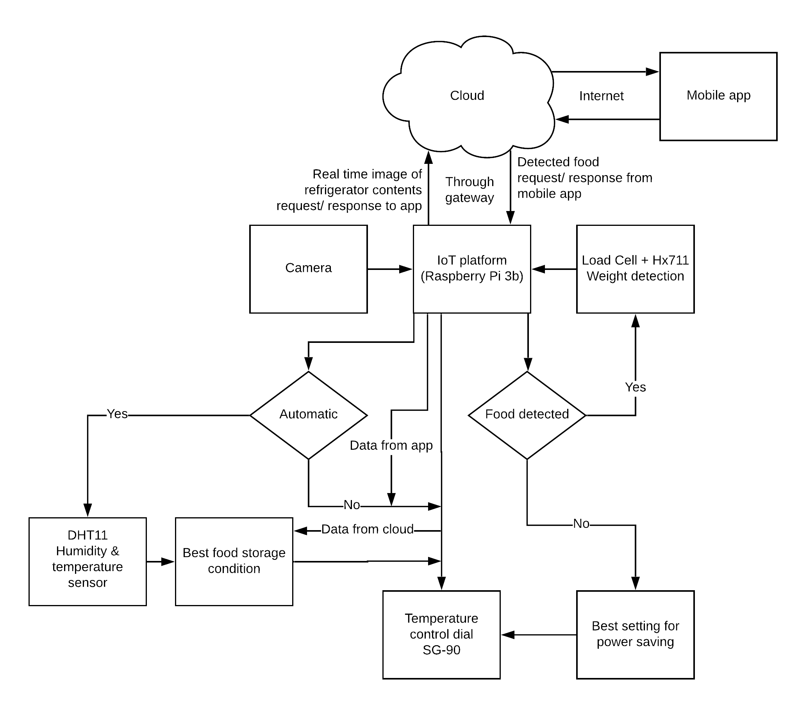
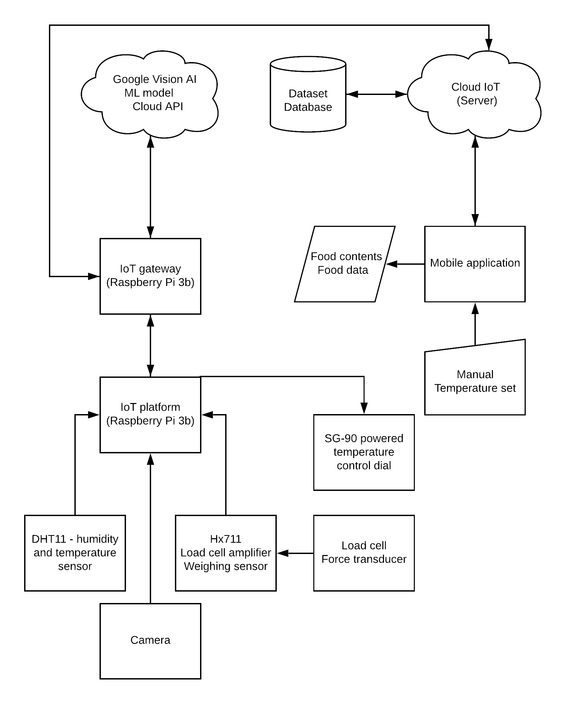
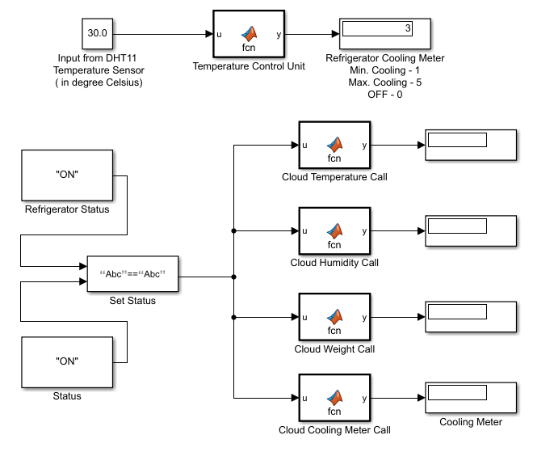

# IoT application in Smart Refrigerator

#### Python, MATLAB, Google Cloud (Google Vision AI), IFTTT

##### Raspberry Pi 3b, USB HD camera, Load cell, Hx711 weighing module, DHT11, MDF cabinet

Smart Refrigerator is smart device/ appliance for a smart home based of Internet of Things (IoT) application which provides all functionalities of a standard refrigerator with addition of smart features of smart sensing through machine learning image recognition and weight sensing, automatic refrigerator settings adjustment according to the recommended environment condition settings, this is made possible through various sensors and hardware integration and connecting them to internet for real time data collection and processing providing live required data and necessary details about the running status of the refrigerator and contents inside the refrigerator including live stream from the refrigerator showing contents that can be used by users at the grocery store as a reference, list of contents with options to buy from popular online grocery stores such as Amazon.in and BigBasket, Calendar integration to keep track of food addition and expiration dates, and providing possible top socially ranked food recipes that can be cooked or made from the refrigerator contents all in just one app. Along with this the device also has integration of smart voice control through Google Assistant integration. 

###### Flow:

The basic system architecture of the Smart Refrigerator system is shown in the above Figure. The 
ow shows representation of data ow in Smart refrigerator of how data is collected from sensors like DHT11, Load Cell + Hx711, web camera passed through IoT gateway (application level) to internet to Adafrut IO cloud (IoT cloud platform) to be stored and used by its open API for accessing the data securely through custom mobile application for smart refrigerator providing user interface and accessing all necessary processed data (from IoT server) providing data about contents in smart refrigerator making it useful through open API's such as Food2Fork and AllRecipe recipe API, Amazon.in and BigBasket in-app search integration and Google Vision AI for automatic food detection. In the proposed scheme Smart refrigerator system is equipped with the sensor and actuator. The sensor and actuator are the part of network which are connected to the device which continuously collect the information and transfer the data through com-
munication protocol using IoT platform. The communication follows the TCP/IP client server model. IP address of the board (raspberry pi) is used for providing live contents from refrigerator to mobile app (live webcam stream) and Adafruit IO API is used for receiving the sensor data from device and sending the data to server and cloud to make it accessible to mobile application. The application is self maintainable as it is digitally designed (through python programming language) to sense certain condition changes in smart refrigerator and act accordingly to perform required actions and restoring back to stable or active state
once the required action is performed. The program has integration with Adafruit IO connection, paho MQTT (for sending or publishing captured image le from device to server), integration with sensors and actuators for data collection and performing actuation at device end. On server end the program is configured with paho MQTT for receiving or subscribing the captured image le and then send it to Google cloud platform (Vision AI API) for prediction of food items and updating the current food item in Adafruit IO.

###### Hardware flow:

###### Simulation: 

The simulation and API testing for the application was done in MATLAB.

----------------

#### Links:

* [Documentation](https://github.com/shivamsingh25/IoT_application_Smart_Refrigerator/tree/master/Documentation)
* [Smart Refrigerator Mobile application repository](https://github.com/shivamsingh25/Smart_Refrigerator_App)
* [Behance](https://www.behance.net/gallery/91605643/IoT-application-in-Smart-Refrigerator)